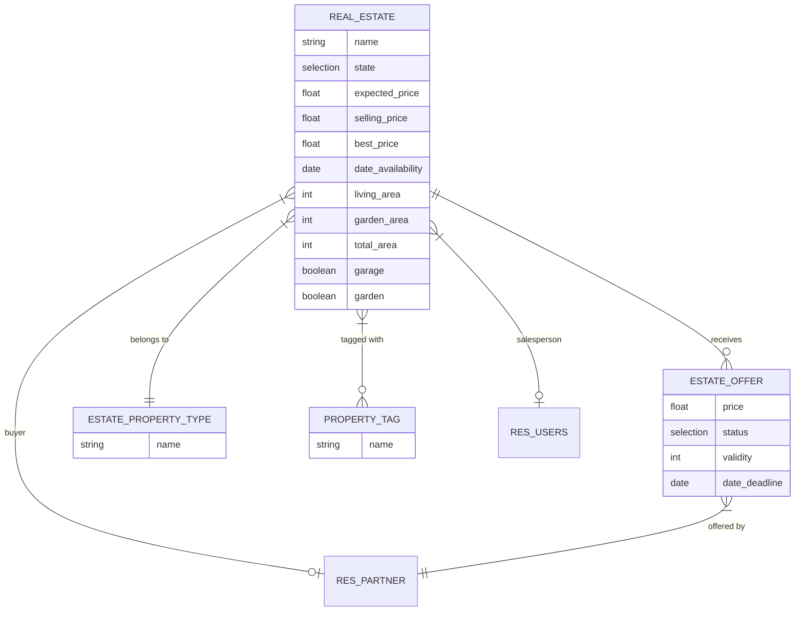
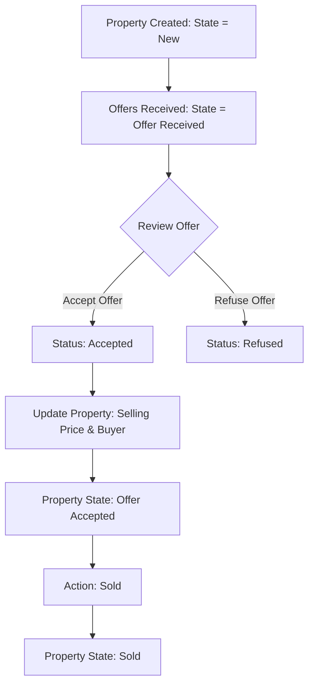

# 🏡 Odoo Real Estate Management Module (`estate`)

[](https://www.odoo.com/)
[](https://www.python.org/)
[](https://www.postgresql.org/)
[](https://www.gnu.org/licenses/lgpl-3.0)
[](https://github.com/mohanedSalaheldin/odoo19-estate)

> **A custom, full-featured Real Estate Management System built on the Odoo ERP framework.**  
> Designed to manage property advertisements, offers, buyers, pricing constraints, automated computations, and lifecycle workflows adhering to Odoo ORM best practices.

---

## 📌 Table of Contents
- [Overview](#-overview)
- [Key Features](#-key-features)
- [Technical Highlights](#-technical-highlights)
- [Data Model & Architecture](#-data-model--architecture)
- [Business Logic & Workflows](#-business-logic--workflows)
- [Security & Access Rights](#-security--access-rights)
- [Module Structure](#-module-structure)
- [Installation & Setup](#-installation--setup)
- [Usage Guide](#-usage-guide)
- [Author & Portfolio](#-author--portfolio)

---

## 📖 Overview

The **Real Estate (`estate`)** module is an end-to-end business application built from scratch to demonstrate proficiency in Odoo backend development. It streamlines the lifecycle of real estate properties—from listing and categorizing advertisements, to receiving buyer bids, validating offers, and closing sales.

This project showcases mastery over the **Odoo ORM API**, relational modeling, computed fields with inverse logic, automated validation constraints, multi-level security access, and responsive XML view designs.

---

## ✨ Key Features

### 🏢 Property Management
- **Detailed Property Listings**: Manage property details including title, type, tags, postcode, availability dates, expected price, bedrooms, living area, facades, garage, and garden.
- **Dynamic Property Categorization**: Categorize properties by custom types (e.g., *Residential, Commercial, Land*) and tags (e.g., *Renovated, Cozy, Sea View*).
- **Automated Lifecycle States**: Structured status bar tracking state transitions: `New` ➔ `Offer Received` ➔ `Offer Accepted` ➔ `Sold` or `Canceled`.

### 💰 Offer & Bidding Engine
- **Multi-Offer Handling**: Record multiple buyer offers with custom validity periods.
- **Automated Expiration Calculation**: Dynamic computation of offer deadlines and inverse calculation for validity days.
- **One-Click Acceptance/Refusal**: Action buttons on offer lines to accept or refuse bids directly, automatically updating the buyer and agreed selling price on the parent property.

### ⚙️ Smart Business Logic & Automation
- **Best Offer Calculation**: Dynamically computes and displays the highest offer received.
- **Total Area Calculation**: Auto-sums living area and garden area.
- **Default Garden Handling**: Intelligent `onchange` events that set default garden sizes and orientations upon toggling.
- **Strict Business Validation Rules**:
  - Expected price must be strictly positive (`> 0`).
  - Selling price cannot be lower than **90%** of the expected price.
  - State guards prevent editing or transitioning canceled properties to sold (and vice versa).

---

## 🛠️ Technical Highlights

| Area | Technologies & Concepts Implemented |
| :--- | :--- |
| **Backend Framework** | Odoo 19 / Python 3 |
| **Database** | PostgreSQL with Relational Mapping & SQL Constraints |
| **ORM Decorators** | `@api.depends`, `@api.onchange`, `@api.constrains`, `compute` & `inverse` methods |
| **Data Integrity** | `models.Constraint` (SQL constraints) and `ValidationError` / `UserError` exception handling |
| **Security (ACL)** | Role-based Access Control via `ir.model.access.csv` & User Groups (`res.groups`) |
| **Views & UI** | XML Form Views, List/Tree Views, Custom Search Filters, Statusbar Widgets, Notebook Tabs |

---

## 🗂️ Data Model & Architecture



---

## 🔄 Business Logic & Workflows

### 1. Offer Acceptance Workflow


### 2. Guardrails & Validations
- **Price Protection**: When an offer is accepted or selling price is set, Odoo verifies that `selling_price >= expected_price * 0.90`.
- **Date Check**: Onchange warning triggers if a past availability date is selected.
- **State Integrity**: An exception (`UserError`) is raised if an agent attempts to sell a canceled property or cancel a sold property.

---

## 🔒 Security & Access Rights

The module defines granular access permissions through security groups and Access Control Lists:

- **Security Groups** (`security/res_groups.xml`):
  - **Estate Manager** (`estate.estate_manager`): Full administrative control over all real estate records, configurations, types, and tags.
  - **Internal User** (`base.group_user`): Standard read/write access for property listings and offers.
- **Access Control List** (`security/ir.model.access.csv`):
  - Configured CRUD permissions across `real.estate`, `estate.property.type`, `estate.offer`, and `property.tag`.

---

## 📂 Module Structure

```text
odoo19-estate/
├── custom_addons/                # Custom & Community UI/UX themes
│   └── muk_web_*                 # Modern web interface enhancements
├── my_addons/
│   └── estate/                   # Main Real Estate Custom Module
│       ├── __init__.py
│       ├── __manifest__.py       # Module metadata & asset declarations
│       ├── models/               # Python ORM Models & Business Logic
│       │   ├── __init__.py
│       │   ├── models.py         # Main 'real.estate' model
│       │   ├── estate_offer.py   # 'estate.offer' model & bidding logic
│       │   ├── estate_property_type.py # 'estate.property.type' model
│       │   └── property_tag.py   # 'property.tag' model
│       ├── security/             # Access control rules & groups
│       │   ├── ir.model.access.csv
│       │   └── res_groups.xml
│       ├── views/                # User interface definitions (XML)
│       │   ├── estate_menus.xml
│       │   ├── estate_property_views.xml
│       │   ├── estate_offer_views.xml
│       │   ├── property_type_views.xml
│       │   ├── property_tag_views.xml
│       │   ├── templates.xml
│       │   └── views.xml
│       └── demo/                 # Demonstration data
└── README.md                     # Project documentation
```

---

## 🚀 Installation & Setup

### Prerequisites
- **Python 3.10+**
- **PostgreSQL 14+**
- **Odoo 19 / 18 / 17 Community or Enterprise**

### Step-by-Step Installation

1. **Clone the repository:**
   ```bash
   git clone https://github.com/mohanedSalaheldin/odoo19-estate.git
   cd odoo19-estate
   ```

2. **Set up a Python Virtual Environment:**
   ```bash
   python -m venv venv
   # On Windows:
   .\venv\Scripts\activate
   # On Linux/macOS:
   source venv/bin/activate
   ```

3. **Install dependencies:**
   ```bash
   pip install -r requirements.txt
   ```

4. **Start the Odoo server with the addons path:**
   ```bash
   python odoo-bin -c odoo.conf --addons-path=addons,my_addons,custom_addons -d odoo_estate -u estate
   ```

5. **Activate the Module in Odoo:**
   - Log in to your Odoo database as Administrator.
   - Enable **Developer Mode** (`Settings > Activate Developer Mode`).
   - Navigate to **Apps > Update Apps List**.
   - Search for `estate` (Real Estate) and click **Install / Upgrade**.

---

## 💡 Usage Guide

1. **Create Property Types & Tags**: Go to `Estate > Settings > Property Types` and `Property Tags` to create custom classifications.
2. **Post a New Property**: Navigate to `Estate > Advertisements > Estates` and click **New**. Enter property details, expected price, and amenities.
3. **Log Buyer Offers**: In the **Offers** tab of the property, add offers from interested partners with specified prices and validities.
4. **Accept an Offer**: Click the **Accept** (✔) button on the best offer. The property's buyer and selling price will automatically populate.
5. **Mark as Sold**: Click the **Sold** button in the header bar to complete the transaction.

---

## 👨‍💻 Author & Portfolio

**Mohaned Salaheldin**  
*Odoo & Python Developer*

- 🌐 **GitHub**: [@mohanedSalaheldin](https://github.com/mohanedSalaheldin)
- 💼 **LinkedIn**: [linkedin.com/in/mohanedsalaheldin](https://www.linkedin.com/in/)
- 📧 **Email**: [mohanedsalaheldin@gmail.com](mailto:mohanedsalaheldin@gmail.com)

---

<div align="center">
  <sub>Built with ❤️ using the Odoo ERP Framework.</sub>
</div>
